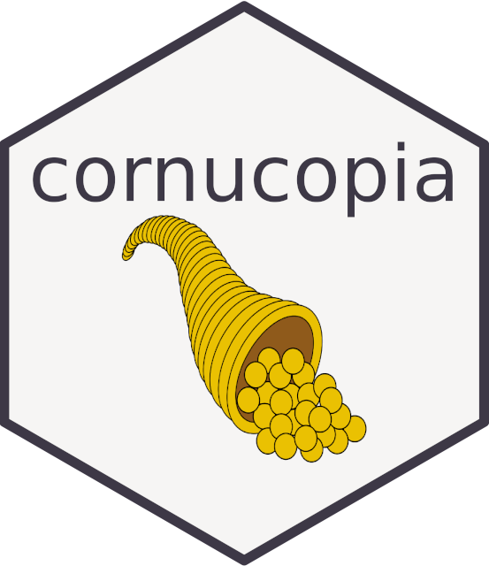

<!-- README.md is generated from README.Rmd. Please edit that file -->

# cornucopia <a href='https://github.com/giocomai/cornucopia'></a>

<!-- badges: start -->

[](https://lifecycle.r-lib.org/articles/stages.html#experimental)
<!-- badges: end -->

The goal of cornucopia is to facilitate reporting on sponsored and
organic activities on Facebook, Instagram, and LinkedIn (currently), as
well as to estimate and visualise the result of marketing funnels (long
term).

## Why `cornucopia`?

For you all marketing folks, a cornucopia is like a funnel that keeps on
giving. Also known as the “[horn of
plenty](https://en.wikipedia.org/wiki/Cornucopia)”, it’s basically
really your wildest dream: a funnel that endlessly overflows with
abundance.

Hence, the marketing slogan of `cornucopia` is:

***turn your every funnel into a cornucopia!***

The premise of `cornucopia` is that there’s plenty of small and big
platforms that can be used to interact with the API of big “social
networks”/advertising platforms, but there’s really just a few open
source packages in the `r` ecosystem openly available in this space.
Some of these packages are of excellent quality, but overall there’s a
steep learning curve when joining this space, and few tools enabling the
beginner-intermediate users to look at these interrelated processes in
an orderly fashion, or to facilitate some routine work for more advanced
users.

Long term, this is the purpose of `cornucopia`, which is currently at an
early stage of development.

As these so called “social networks” are all, at their core, marketing
tools, throughout the package documentation I will use the language
found on each platform’s website and use marketing terms by default.
Needless to say, this can be used for reporting of non-profit websites,
or for optimising conversions that are not purchases, etc.

Please enjoy `cornucopia` responsibly.

## Experimental package warning

Again, keep in mind that this is an incomplete and not fully tested
package. It currently uses only API calls that *read* data, so it should
be safe to use. But:

- it tries to cache data for efficency and speed, but the caching
  mechanisms may not always work, so make sure the extracted data are
  fit for purpose (more testing will be introduced)

Also, the usual disclaimer: this free software comes with absolutely no
warranty.

## Installation

You can install the development version of cornucopia with:

``` r
remotes::install_github("giocomai/cornucopia")
```

## Settings

You can you use `cc_set()` to set start and end dates to be used by all
other functions, as well as tokens, user identifiers, and caching
preferences. You can provide as many or as few settings as you like. You
can also pass the same as parameters to individual functions, without
using `cc_set()` at all.

``` r
library("cornucopia")
dates_l <- cc_set(
  start_date = "2023-01-01",
  end_date = Sys.Date() - 1,
)

dates_l$start_date
#> [1] "2023-01-01"
```

Here is a full list of parameters that can be set with `cc_set()`:

`start_date`, `end_date`, `fb_user_token`, `fb_page_token`,
`fb_page_id`, `fb_business_id`, `fb_ad_account_id`,
`fb_product_catalog_id`, `fb_user_id`, `ig_user_id`

## Meta / Facebook / Instagram

In order to get data out of the Meta ecosystem through APIs, you will
need to create an app following the [procedure on their Developer
platform](https://developers.facebook.com/apps/create/).

You can then get your token from your app page:
<https://developers.facebook.com/apps/>

Be mindful that the Meta APIs never, ever, return meaningful error
messages, and the documentation has only few examples… as some queries
work or not depending on the type of ad (its creatives/its format/etc.)
or the type of organic post (is it a video? if so, is it a reel? etc.),
there’s often some trial and error involved.

### Organic - Facebook pages

Data about Facebook pages need to be accessed with a Facebook *page*
token, that is separate to the Facebook *user* token.

The first step is then to retrieve one’s own Facebook user id:

``` r
cc_get_fb_user()
```

And then use the Facebook user id to request all pages managed by that
Facebook user, including the relevant Facebook page token:

``` r
cc_get_fb_managed_pages()
```

It is this page token that can then be used to retrieve information
about a given page.

If you just need to get the token, you can retrieve it as follows:

``` r
fb_page_token <- cc_get_fb_page_token(
  fb_user_id = cc_get_fb_user(),
  page_name = "My example page"
)
```

Now that you have it, you probably want to set it as the page token to
be used throughout the current session:

``` r
cc_set(fb_page_token = fb_page_token)
```

(if you prefer, you can actively pass the token to each function call)

Good, now you have your Facebook Page Token, which you can use to get
information about your page and posts, what do you do next? (also, be
mindful that the same token can be used also to actually post on your
page, so treat it with due caution and make sure it remains private)

Then, you probably want to get a list of all posts from your page.

``` r
posts_df <- cc_get_fb_page_posts()
```

Yes, you probably have *a lot* of posts, but this function caches result
by default, so you will have to do it only once, and then only newer
posts will be retrieved, so it may be worth your time. If you don’t want
to wait and just need a few posts, then you can retrieve only the most
recent posts with something like:

``` r
posts_df <- cc_get_fb_page_posts(
  max_pages = 10,
  cache = FALSE
)
```

Which will retrieve the most recent 10 pages of posts (each page has 25
posts, so you do the math).

Besides Facebook post id, you already get some other basic information
about each of the posts, namely:

`created_time`, `id`, `permalink_url`, `message`, `full_picture`,
`icon`, `is_hidden`, `is_expired`, `instagram_eligibility`,
`is_eligible_for_promotion`, `promotable_id`, `is_instagram_eligible`,
`is_popular`, `is_published`, `is_spherical`, `parent_id`,
`status_type`, `story`, `subscribed`, `sheduled_publish_time`,
`updated_time`

But you probably want to know more. There’s a bunch of different things
you can find out, and these vary depending on the type of post. But the
most common next step is probably to get some more information about
these posts with:

``` r
cc_get_fb_page_post_insights()
```

\[to do\]

``` r
cc_get_fb_page_insights()
```

``` r
cc_get_fb_page_video()

cc_get_fb_video_insights()
```

### Meta ads

For the time being, `cornucopia` partly relies on
[`fbRads`](https://github.com/daroczig/fbRads) to get data about
sponsored campaigns and store them locally (long terms, all API calls
will be done directly by `cornucopia` for consistency).

``` r
token <- "looooooooooong_string"

account <- "00000000000000000"

fbad_init(
  accountid = account,
  token = token
)

ads_df <- cc_get_fb_ads()
```

Notice that if you ask for a lengthy period, you may hit the API query
limit. The error message is however not helpful, as it apparently
complains about `fields`. Just wait and try again after a few hours: all
downloaded data are by default stored in a local folder and nothing will
lost, queries will be made only for missing data.

If you’re hitting the API limits but what to proceed with writing your
code as you wait, you can set the `only_cached` parameter to TRUE, so
you can proceed with your analysis with the data you have until you’ll
be able to download more data.

``` r
ads_df <- cc_get_fb_ads(only_cached = TRUE)
```

Notice that you can customise the fields to retrieve and that not all
fields can be asked at the same time. See the embedded list
`cc_valid_fields_ad_insights` for list of valid fields, divided by broad
categories (this subdivision has been made by the package author, not by
Facebook itself). Caching of retrieved contents by type of fields will
be addedt to future versions.

Not all ad-related information, however, can be retrieved through this
endpoint.

### Creatives

For example, if you want details about the creatives used in an ad, you
will first need to make queries to retrieve the `creative_id` associated
with each ad ([see documentation of this
endpoint](https://developers.facebook.com/docs/marketing-api/reference/adgroup/adcreatives/)),
and only then query the [ad creative
endpoint](https://developers.facebook.com/docs/marketing-api/reference/ad-creative/)
to retrieve relevant information about the creative.

The first step of this process, i.e. retrieving `creative_id` can be
achieved by passing a vector of `ad_id` to
`cc_get_fb_ad_creatives_id()`. Data will be cached locally by default,
assuming creatives will mostly be added at the time when the ad is
created.

### Action breakdowns

Here’s more interesting information, but also where caching gets
trickier. But say, you are interested in `actions` by day and by ad, you
can use `cc_get_fb_ad_actions_by_day`, passing to it a vector of `ad_id`
(or `adset_id`, for that matter, the APIs don’t seem to mind), and
you’ll get a daily breakdown.

You can get even more details: for example, do you want to know how many
of those viewing your video ads had the sound on:

``` r
cc_get_fb_ad_actions_by_day(
  ad_id = example_id,
  type = "actions",
  action_breakdowns = "action_video_sound"
) |>
  dplyr::filter(is.na(action_video_sound) == FALSE)
```

For many such breakdowns, including this one, you get a meaningful
breakdown only if your ad is relevant. For example, if the `example_id`
above is of an ad that does not have any video, no information is
returned. If you ask for `product_id` for an ad that is not based on
catalogue, you won’t get anything. And so on.

See the [official
documentation](https://developers.facebook.com/docs/marketing-api/insights/breakdowns/)
for details.

Caching does not really work with this function at this stage, as no
consistent approach for updating cached data has been implemented, yet.

### Instagram

As for all things related to Meta’s API, you will need an app, and a
valid token with all the needed permissions (not having the right
permissions is the most frequent problem you’ll find, so when
troubleshooting, take it from there).

So first set your `ig_user_id` and your token.

``` r
cc_set(
  ig_user_id = "00000000000000000", # probably about 17 digits, not the legacy Instagram id
  fb_user_token = "loooong_string"
) # the regular token, not the "page token"
```

And you can get some basic information about your profile:

``` r
cc_get_instagram_user()
```

Or just some specific fields:

``` r
cc_get_instagram_user(fields = c("username", "followers_count"))
```

In order to get detailed information about each of your posts, you first
need to know their `ig_media_id`. You can get this id for all of your
posts with the following command:

``` r
cc_get_instagram_media_id()
```

Be mindful that this may make many queries, as Instagram gives the
result in batches of 25… if you have thousands of media, it may take
some time. Data are however cached locally by default.

You can then pass the resulting `ig_media_id` to
`cc_get_instagram_media()` to get more information about a given
Instagram post.

``` r
cc_get_instagram_media()
```

Responses to `cc_get_instagram_media()` are cached by default, and
updated with decreasing frequency as posts get older (data are refreshed
every day for the last week, once a week for the last month, once a
month for the last year, once a year for previous years). As a
consequence, you should mostly be able to keep this in scripts and rely
on it to autoaupdate data without much delay.

## LinkedIn

LinkedIn does not allow for exporting statistics about pages or ads
systematically, if not by using one of a very small number of
ridiculously expensive third party services.

This complicated the independent processing of the data, as well as
their inclusion in third party dashboard.

To deal with both of these issues, `cornucopia` includes a set of
functions that facilitates:

- processing files with statistics exported from LinkedIn
- store them locally in a consistent manner
- keep them updated in a set of Google Sheets, in order to facilitate
  their integration with services such as Looker Studio

The user just needs to download relevant files and store them in a
folder, without paying attention to anything else, really. Files for
more than one page can be included in the same folder and no special
attention needs to be dedicated to the time period included:
`cornucopia` will always strive to include data for the longest possible
period, always preferring the most recent data available. For this
reason, it is usually easiest to export data about the last 365 days,
and let this package deal with the rest.

Export files for all sorts of a statics from your LinkedIn page. They
will have file names such as “pagename_followers_1684688073420.xls”.
Throw all of them in a folder, that we’ll call “LinkedIn_stats”.

You can then retrieve some basic information about these files using:

``` r
cc_get_linkedin_stats_files(path = "LinkedIn_stats")
```

This allows to see when a file was exported, what is the name of the
page, and what type of statistics it includes: all of this information
can be gathered from the file name.

Each of the statistics types exported from LinkedIn has its own data
format, and indeed there is little consistency in these files, if not
for the ridiculous insistence on including dates in the ridiculous US
date format (month-day-year), no matter where you are in the world.

Anyway… we can now move on to the specific functions for each type of
statistics. The following functions parse all relevant files and merge
the data preferring the most recently downloaded data over older files
(this may be irrelevant in many cases, but may well have some impact in
statistics associated with a given post).

``` r
followers_df <- cc_get_linkedin_stats_followers(
  path = "LinkedIn_stats",
  page = "example-page"
)
```

Once we have these data, we can of course process them as we usually
would. But for the sake of this post, we are imagining a workflow that
requires us to upload these files to a Google Sheet, in order to
facilitate data retrieval through Google Looker Studio.

We can do this manually, but, of course, we’d much rather use a set of
convenience functions that will process data and upload them
automatically to the same Google Sheet, updating the dataset if one was
previously uploaded.

``` r
cc_drive_upload_linkedin_stats_followers(
  path = "LinkedIn_stats",
  page_name = "example-page"
)

cc_drive_upload_linkedin_stats_content(
  path = "LinkedIn_stats",
  page_name = "example-page"
)

cc_drive_upload_linkedin_stats_visitors(
  path = "LinkedIn_stats",
  page_name = "example-page"
)
```

## Disclaimer

I despise ad-tech, but I’ve got work to do.

## License

`cornucopia` is released under a MIT license.
